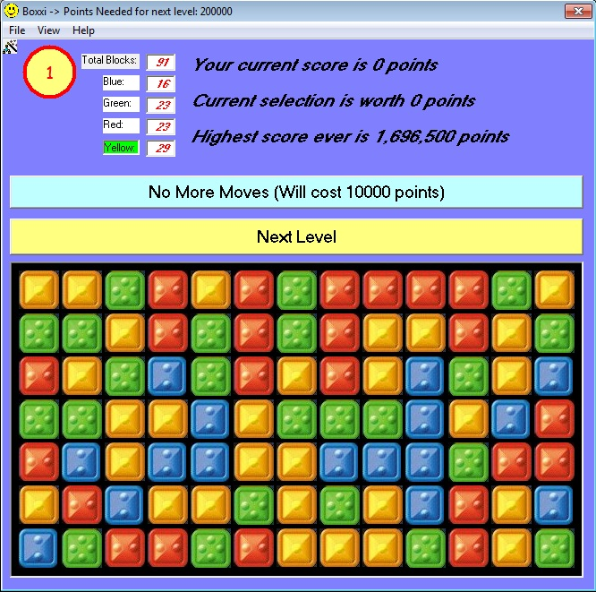



## Boxxi

### Description

A new Boxxi game. Select groups of blocks to remove. Based loosely on a game I downloaded on Planet several years ago. The person's name was Dvadi I think. This version uses his blocks, but all of the programming is new and completely commented. This code demonstrates the use of arrays of UDA's, and is just a lot of fun to play. The high score is stored in an ASCII text file in the program directory (no messing with the registry!!!) If you like it, please vote.
 
### More Info
 

             |
---                |---
**Submitted On**   |2011-06-27 10:26:58
**By**             |[bikeguy](https://github.com/Planet-Source-Code/PSCIndex/blob/master/ByAuthor/bikeguy.md)
**Level**          |Intermediate
**User Rating**    |5.0 (20 globes from 4 users)
**Compatibility**  |VB 6\.0
**Category**       |[Games](https://github.com/Planet-Source-Code/PSCIndex/blob/master/ByCategory/games__1-38.md)
**World**          |[Visual Basic](https://github.com/Planet-Source-Code/PSCIndex/blob/master/ByWorld/visual-basic.md)
**Archive File**   |[Boxxi2207036272011\.zip](https://github.com/Planet-Source-Code/bikeguy-boxxi__1-73976/archive/master.zip)

